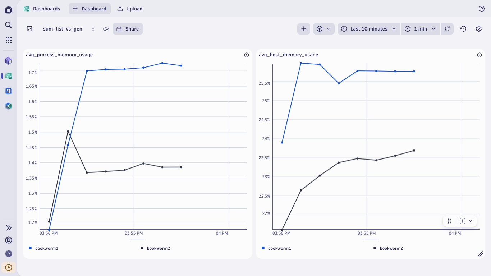

# Benchmarking Memory Usage: List vs. Generator in Python

This project demonstrates the stark differences in memory usage between list comprehensions and generator expressions when processing large datasets in Python.

## Overview

The experiment compares two strategies for calculating cumulative sums:

- **List-Based Computation**  
  Attempts to calculate the sum using a list comprehension:  
  ```bash
  python3 -c "sum([i for i in range(10**6)])"
  ```  
  This method allocates all the numbers in memory. When scaled to 10^9 (for example), the memory usage spikes, often resulting in the process being killed (it happens to me).

- **Generator-Based Computation**  
  Uses a generator expression, which computes one value at a time without retaining an entire list in memory:  
  ```bash
  python3 -c "sum(i for i in range(10**6))"
  ```  
  This approach is much more memory efficient, allowing the sum to be computed without excessive memory overhead.

> **Key Insight:**  
> The failure of the list-based method vividly illustrates that explicit memory allocation for large-scale computations can be catastrophic, whereas generators offer a lazy evaluation mechanism that minimizes runtime memory consumption.

## Project Architecture

The project uses a combination of Vagrant, Ansible, and Dynatrace for orchestration, provisioning, and monitoring:

- **Vagrantfile**  
  Sets up two Debian virtual machines (VMs) using the Debian Bookworm box. Both VMs are configured with 2 CPUs and 2GB of RAM.  
  - `debian_vm1` will run the list-based summation test.
  - `debian_vm2` will run the generator-based summation test.

- **Ansible Playbooks**  
  - **`install_oneagent.yml`**:  
    - Copies and installs the Dynatrace OneAgent on all Debian VMs.
    - Ensures the OneAgent service is running, enabling real-time process monitoring.
  
  - **`benchmark.yml`**:  
    - Schedules the execution of the performance tests:
      - For `debian_vm1`: Executes the list comprehension summation.
      - For `debian_vm2`: Executes the generator expression summation.
    - Both tasks are run asynchronously (with a 600-second timeout) to allow a proper performance comparison.

- **Dynatrace Dashboard**  
  Serves as the monitoring tool to visualize and compare the in-process memory usage between the two methods in real time.

## How to Run

1. **Prerequisites**:  
   Ensure that you have the following installed on your system:
   - Vagrant
   - A provider like Libvirt (or VirtualBox, if you adjust the provider settings)
   - Ansible
   - Dynatrace OneAgent

2. **Provision the VMs**:  
   Open a terminal and run:
   ```bash
   vagrant up
   ```

3. **Install Dynatrace OneAgent**:  
   Run the following Ansible playbook to install OneAgent on the VMs:
   ```bash
   ansible-playbook install_oneagent.yml
   ```

4. **Execute Benchmarks**:  
   Run the benchmark playbook to initiate the tests:
   ```bash
   ansible-playbook benchmark.yml
   ```

5. **Monitor and Analyze**:  
   Access your Dynatrace Dashboard to monitor the memory usage and performance differences between the two tests. Two important DQL (Dynatrace Query Language) scripts have been provided to help you visualize the metrics: **Host Memory Usage Query (`avg_host_memory_usage.dql`)** and **Process Memory Usage Query (`avg_process_memory_usage.dql`)**. This query displays the average memory usage of processes per host over time, highlighting the differences between the two memory consumption approaches. Below is an image of the Dynatrace Dashboard (`dashboard.png`) that visualizes the memory usage metrics from the DQL queries:



## Observations & Conclusion

- **List-Based Approach**:  
  Requires the entire range of numbers to be stored in memory, leading to high memory consumption and eventual failure (process being killed).

- **Generator-Based Approach**:  
  Uses lazy evaluation, allowing for computation with minimal memory usage even when summing through large ranges.

This project underscores the importance of choosing memory-efficient methodologies in Python, especially for tasks involving large data sets or computations.

## EOR (END OF REPOSITORY)

### Moitas grazas por ler iste README\.me !!!
### Muchas gracias por leer este README\.me !!!
### Thanks you very much for reading this README\.md !!!
